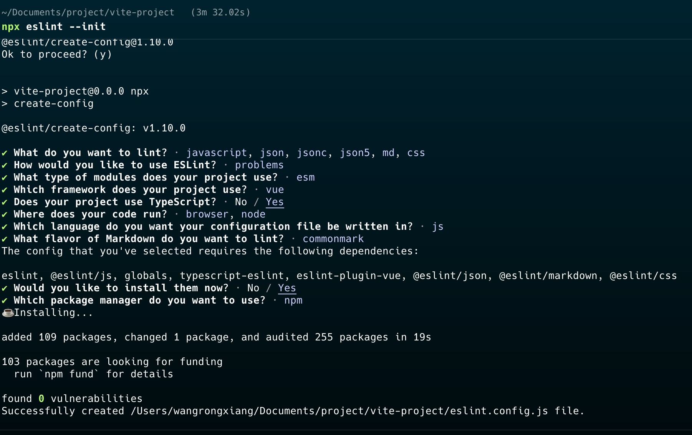

## 搭建vite 项目

切换到存放项目的目录，例如：

```bash
cd Documents/project
```

查看 node 版本：

搭建项目前先确认 node 版本：**Vite 需要 [Node.js](https://nodejs.org/en/) 版本 20.19+, 22.12+，**建议使用 [nvm](https://nvm.uihtm.com/doc/guide.html) 管理node 版本

```bash
node -v
```

使用 20 版本 node：


使用 vite 命令搭建项目

```bash
npm create vite@latest
```

回车后按照提示进行配置：


切换到项目目录：

```bash
cd vite-project
```

安装依赖：

```bash
npm i
```

启动项目：

```bash
npm run dev
```


至此 vite + vue3 + TS 项目骨架已完成，接下来完善项目配置，集成：Vue Router、Vuex|pinia、Axios、Sass、EsLint、prettier、stylelint、editConfig、npmrc、tsconfig、lodash、autoImport、compress

## 完善目录结构

```bash
vite-project/
├── .cursor/                        // Cursor IDE 配置目录
├── .vscode/                       // VS Code 编辑器配置目录
├── dist/                          // 构建输出目录
├── node_modules/                  // npm 依赖包目录
├── docs/                          // 项目文档目录
├── public/                        // 公共静态资源目录
├── scripts/                       // 构建和部署脚本目录
├── patches/                       // 第三方库补丁文件
├── src/                          // 源代码目录
│   ├── api/                      // API 接口目录
│   ├── assets/                   // 静态资源目录
│   ├── components/               // 公共组件目录
│   ├── configs/                  // 配置文件目录
│   ├── directive/                // 自定义指令目录
│   ├── hooks/                    // Vue Hooks 目录
│   ├── mixins/                   // 混入文件目录
│   ├── plugins/                  // 插件配置目录
│   ├── router/                   // 路由配置目录
│   ├── static/                   // 静态配置目录
│   ├── store/                    // 状态管理目录
│   ├── types/                    // TypeScript 类型定义目录
│   ├── views/                    // 页面组件目录
│   ├── App.vue                   // 根组件
│   ├── main.ts                   // 应用入口文件
│   └── permission.js             // 权限控制
├── typings/                      // 全局类型定义目录
├── vite-plugins/                 // Vite 插件目录
├── .cursorignore                 // Cursor IDE 忽略文件配置
├── .editorconfig                 // 编辑器统一配置
├── .eslint.config.js             // ESLint 代码质量检查配置
├── .gitignore                    // Git 忽略文件配置
├── .npmrc                        // npm 配置文件
├── .prettierrc                   // Prettier 代码格式化配置
├── .stylelintrc.js              // StyleLint CSS/SCSS 代码检查配置
├── index.html                  // 应用入口 HTML 文件
├── package.json                // 项目依赖和脚本配置
├── package-lock.json           // npm 依赖锁定文件
├── README.md                   // 项目说明文档
├── stats.html                  // 构建分析报告文件
├── tsconfig.json              // TypeScript 编译配置
├── tsconfig.node.json         // Node.js 环境 TypeScript 配置
└── vite.config.ts           // Vite 构建工具配置
```

## ESLint、prettier、stylelint、editorconfig 代码规范

### ESLint

[ESLint](https://eslint.org/) 是一款用于查找并报告代码中问题的工具，并且支持部分问题自动修复。其核心是通过对代码解析得到的 AST（Abstract Syntax Tree 抽象语法树）进行模式匹配，来分析代码达到检查代码质量和风格问题的能力。

1. 安装：

```bash
npm install eslint -D
```

2. 配置
   ESLint 安装成功后，执行 npx eslint --init，然后按照终端操作提示完成一系列设置来创建配置文件。
   
   执行完成后会在根目录下生成 .eslint.config.js 文件

    > ESLint v8.23.0+ (2023年引入)将配置文件从 .eslintrc.js 改为 .eslint.config.js 文件

3. eslint 依赖插件：

```bash
npm install eslint-plugin-prettier -D
npm install @eslint/css -D
npm install @eslint/js -D
npm install @eslint/json -D
npm install @eslint/markdown -D
npm install @typescript-eslint/eslint-plugin -D
npm install @typescript-eslint/parser -D
npm install eslint -D
npm install eslint-config-prettier -D
npm install eslint-import-resolver-alias -D
npm install eslint-import-resolver-typescript -D
npm install eslint-plugin-import -D
npm install eslint-plugin-prettier -D
npm install eslint-plugin-simple-import-sort -D
npm install eslint-plugin-vue -D
```

### prettier

[Prettier](https://prettier.io/) 是一款强大的代码格式化工具，支持 JavaScript、TypeScript、CSS、SCSS、Less、JSX、Angular、Vue、GraphQL、JSON、Markdown 等语言，基本上前端能用到的文件格式它都可以搞定，是当下最流行的代码格式化工具。

1. 安装：

```bash
npm install prettier -D
```

2. 创建 Prettier 配置文件
   Prettier 支持多种格式的配置文件，比如 .json、.yml、.yaml、.js等。
   在本项目根目录下创建 .prettierrc 文件。

3. 配置
    ```json
    {
    	"useTabs": true,
    	"tabWidth": 4,
    	"printWidth": 150,
    	"singleQuote": true,
    	"trailingComma": "none",
    	"bracketSpacing": true,
    	"semi": false
    }
    ```

注意：vscode 需要安装 prettier 插件：

### stylelint

官网：[stylelint.io](https://stylelint.io/)

### editorconfig

[EditorConfig](https://editorconfig.org/) 有助于为不同 IDE 编辑器上处理同一项目的多个开发人员维护一致的编码风格。

1. 安装：
   需要配合vscode 的 editorconfig 插件：
   

2. 创建 EditorConfig 配置文件

    在项目根目录下创建 .editorconfig 文件：

3. 配置

```bash
# Editor configuration, see http://editorconfig.org
# Editor configuration, see https://github.com/editorconfig/editorconfig/wiki/EditorConfig-Properties

# 表示是最顶层的 EditorConfig 配置文件
root = true

[*] # 表示所有文件适用
charset = utf-8 # 设置文件字符集为 utf-8
indent_style = tab # 缩进风格（tab | space）
indent_size = 4 # 缩进大小
end_of_line = lf # 控制换行类型(lf | cr | crlf)
trim_trailing_whitespace = true # 去除行首的任意空白字符
max_line_length = 150

[*.md] # 表示仅 md 文件适用以下规则
max_line_length = off
trim_trailing_whitespace = false
```

## Vue Router

```bash
npm install vue-router@4
```

在 src 目录下创建 router 目录，然后在 router 目录里新建 index.ts 和 modules 目录：

```bash
└── src/
     ├── router/
         ├── index.ts  // 路由配置文件
         ├── modules/  // 路由模块目录
```

如果系统需要做权限控制，可以通过路由守卫来实现，在 router 目录下新建 permission.ts 文件：

```bash
└── src/
     ├── router/
         ├── permission.ts  // 路由守卫文件
```

permission.ts 文件内容：

```typescript
import router from '@/router'

router.beforeEach(async (to, _, next) => {
	// 如果需要权限控制，可以在这里添加权限控制逻辑
	next()
})

router.afterEach(() => {
	NProgress.done()
})
```

## Vuex|pinia 状态管理

## axios 请求配置

## 静态资源配置

## ESLint、prettier、stylelint 代码规范

## npmrc 版本管理

## sass 配置

## tsconfig 配置

## autoImport 自动导入

## compress 压缩

## 项目管理

### 统一方案

### 文件夹结构

## Vite 配置文件

```typescript
import { defineConfig } from 'vite'
import vue from '@vitejs/plugin-vue'
// 如果编辑器提示 path 模块找不到，则可以安装一下 @types/node -> npm i @types/node -D
import { resolve } from 'path'

export default defineConfig({
	plugins: [vue()],
	base: '/',
	resolve: {
		alias: {
			'@': resolve(__dirname, 'src') // 路径别名：设置 `@` 指向 `src` 目录
		}
	},
	server: {
		port: 3333, // 设置服务启动端口号
		open: true, // 设置服务启动时是否自动打开浏览器
		cors: true, // 允许跨域
		// 接口代理，将请求代理到目标环境
		proxy: {
			'/xx-api': {
				target: 'http://xxx.com/xx-api',
				changeOrigin: true,
				rewrite: (path) => path.replace(/^\/xx-api/, '')
			}
		}
	}
})
```

## .vscode 配置

.vscode 目录下创建 extensions.json 文件，用于配置 vscode 的扩展插件：

```json
{
	"recommendations": ["Vue.volar"]
}
```

settings.json 文件，用于配置 vscode 的设置：

```json
{
	"editor.codeActionsOnSave": {
		"source.fixAll.eslint": "explicit",
		"source.fixAll.stylelint": "explicit"
	}
}
```
