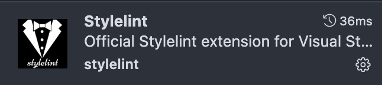

- [搭建vite 项目](#搭建vite-项目)
- [完善目录结构](#完善目录结构)
- [ESLint、prettier、stylelint、editorconfig 代码规范](#eslintprettierstylelinteditorconfig-代码规范)
	- [ESLint](#eslint)
		- [核心ESLint包](#核心eslint包)
		- [JavaScript/TypeScript 支持](#javascripttypescript-支持)
		- [Vue.js 框架支持](#vuejs-框架支持)
		- [代码格式化集成](#代码格式化集成)
		- [模块导入管理](#模块导入管理)
		- [多文件类型支持](#多文件类型支持)
		- [一键安装所有依赖](#一键安装所有依赖)
		- [编辑器插件](#编辑器插件)
	- [prettier](#prettier)
	- [stylelint](#stylelint)
		- [1. StyleLint 依赖插件安装与说明：](#1-stylelint-依赖插件安装与说明)
			- [核心StyleLint包](#核心stylelint包)
			- [标准配置包](#标准配置包)
			- [格式化集成](#格式化集成)
			- [语法解析器](#语法解析器)
			- [一键安装所有依赖](#一键安装所有依赖-1)
		- [2. StyleLint 配置文件](#2-stylelint-配置文件)
		- [3. Package.json 脚本配置](#3-packagejson-脚本配置)
		- [4. 编辑器插件](#4-编辑器插件)
		- [5. 使用方式](#5-使用方式)
	- [editorconfig](#editorconfig)
- [Vue Router](#vue-router)
- [Vuex|pinia 状态管理](#vuexpinia-状态管理)
	- [Vuex](#vuex)
		- [安装：](#安装)
		- [配置：](#配置)
	- [pinia](#pinia)
- [axios 请求配置](#axios-请求配置)
	- [安装：](#安装-1)
	- [配置:](#配置-1)
	- [注册：](#注册)
	- [核心功能](#核心功能)
	- [配置说明](#配置说明)
		- [1. 基本配置](#1-基本配置)
		- [2. Loading 控制机制](#2-loading-控制机制)
		- [3. 请求取消机制](#3-请求取消机制)
		- [4. 文件下载处理](#4-文件下载处理)
		- [5. 业务状态码处理](#5-业务状态码处理)
		- [6. Blob 错误处理](#6-blob-错误处理)
		- [7. 错误处理机制](#7-错误处理机制)
		- [7.1 网络错误](#71-网络错误)
		- [7.2 超时错误](#72-超时错误)
- [npmrc 版本管理](#npmrc-版本管理)
- [Docker 开发环境配置](#docker-开发环境配置)
	- [概述](#概述)
- [sass 配置](#sass-配置)
	- [全局变量](#全局变量)
	- [注册全局变量](#注册全局变量)
	- [这样在scss文件中就可以直接使用全局变量了：](#这样在scss文件中就可以直接使用全局变量了)
- [proxy 代理配置](#proxy-代理配置)
- [@ 路径别名](#-路径别名)
- [autoImport 资源自动导入](#autoimport-资源自动导入)
	- [依赖安装](#依赖安装)
	- [插件配置](#插件配置)
	- [使用效果示例](#使用效果示例)
		- [1. API 自动导入效果](#1-api-自动导入效果)
		- [2. 组件自动导入效果](#2-组件自动导入效果)
		- [3. 样式自动导入效果](#3-样式自动导入效果)
	- [类型定义文件](#类型定义文件)
- [tsconfig 配置](#tsconfig-配置)
	- [配置文件说明](#配置文件说明)
	- [核心配置 (tsconfig.json)](#核心配置-tsconfigjson)
	- [路径别名](#路径别名)
	- [类型定义](#类型定义)
		- [1. 全局业务类型 (typings/global.d.ts)](#1-全局业务类型-typingsglobaldts)
		- [2. Vue 类型支持 (typings/shims-vue.d.ts)](#2-vue-类型支持-typingsshims-vuedts)
	- [开发使用](#开发使用)
		- [Vue 组件类型](#vue-组件类型)
		- [API 类型定义](#api-类型定义)
	- [常见问题](#常见问题)
- [线上环境配置](#线上环境配置)
	- [去除线上环境调试代码](#去除线上环境调试代码)
	- [图片压缩与文件优化](#图片压缩与文件优化)
			- [依赖安装](#依赖安装-1)
			- [插件配置](#插件配置-1)
- [部署](#部署)
- [.vscode 配置](#vscode-配置)
- [推荐插件](#推荐插件)
- [自定义插件](#自定义插件)
- [项目管理](#项目管理)
	- [文件夹管理](#文件夹管理)
	- [component 组件管理](#component-组件管理)
	- [文件管理原则](#文件管理原则)
	- [思考题](#思考题)
	- [风格指南](#风格指南)


## 搭建vite 项目

切换到存放项目的目录，例如：

```bash
cd Documents/project
```

查看 node 版本：

搭建项目前先确认 node 版本：**Vite 需要 [Node.js](https://nodejs.org/en/) 版本 20.19+，**建议使用 [nvm](https://nvm.uihtm.com/doc/guide.html) 管理node 版本

```bash
node -v
```

使用 20 版本 node：


使用 vite 命令搭建项目

```bash
npm create vite@latest
```

回车后按照提示进行配置：


切换到项目目录：

```bash
cd vite-project
```

安装依赖：

```bash
npm i
```

启动项目：

```bash
npm run dev
```


至此 vite + vue3 + TS 项目骨架已完成，接下来完善项目配置，集成：Vue Router、Vuex|pinia、Axios、Sass、EsLint、prettier、stylelint、editConfig、npmrc、tsconfig、lodash、autoImport、compress

## 完善目录结构

```bash
vite-project/
├── .cursor/                        // Cursor IDE 配置目录
├── .vscode/                       // VS Code 编辑器配置目录
├── dist/                          // 构建输出目录
├── node_modules/                  // npm 依赖包目录
├── docs/                          // 项目文档目录
├── public/                        // 公共静态资源目录
├── scripts/                       // 构建和部署脚本目录
├── patches/                       // 第三方库补丁文件
├── src/                          // 源代码目录
│   ├── api/                      // API 接口目录
│   ├── assets/                   // 静态资源目录
│   ├── components/               // 公共组件目录
│   ├── configs/                  // 配置文件目录
│   ├── directive/                // 自定义指令目录
│   ├── hooks/                    // Vue Hooks 目录
│   ├── mixins/                   // 混入文件目录
│   ├── plugins/                  // 插件配置目录
│   ├── router/                   // 路由配置目录
│   ├── static/                   // 静态配置目录
│   ├── store/                    // 状态管理目录
│   ├── types/                    // TypeScript 类型定义目录
│   ├── views/                    // 页面组件目录
│   ├── utils/                    // 工具函数目录
│   ├── App.vue                   // 根组件
│   ├── main.ts                   // 应用入口文件
│   └── permission.js             // 权限控制
├── typings/                      // 全局类型定义目录
├── vite-plugins/                 // Vite 插件目录
├── .cursorignore                 // Cursor IDE 忽略文件配置
├── .editorconfig                 // 编辑器统一配置
├── .eslintignore                 // ESLint 忽略文件配置
├── .eslintrc                     // ESLint 代码质量检查配置
├── .gitignore                    // Git 忽略文件配置
├── .npmrc                        // npm 配置文件
├── .prettierrc                   // Prettier 代码格式化配置
├── .stylelintrc.js              // StyleLint CSS/SCSS 代码检查配置
├── index.html                  // 应用入口 HTML 文件
├── package.json                // 项目依赖和脚本配置
├── package-lock.json           // npm 依赖锁定文件
├── README.md                   // 项目说明文档
├── stats.html                  // 构建分析报告文件
├── tsconfig.json              // TypeScript 编译配置
├── tsconfig.node.json         // Node.js 环境 TypeScript 配置
└── vite.config.mts          // Vite 构建工具配置
```

## ESLint、prettier、stylelint、editorconfig 代码规范

### ESLint

[ESLint](https://eslint.org/) 是一款用于查找并报告代码中问题的工具，并且支持部分问题自动修复。其核心是通过对代码解析得到的 AST（Abstract Syntax Tree 抽象语法树）进行模式匹配，来分析代码达到检查代码质量和风格问题的能力。

1. 安装：

```bash
npm install eslint@8.28.0 -D
```

2. 配置

如果想要从头生成一份配置：执行 npx eslint --init，然后按照终端操作提示完成一系列设置来创建配置文件。

执行完成后会在根目录下生成 .eslint.config.js 文件
[eslintConfig](./eslintConfig.md)
注意，IDE 的 settings 中需要配置保存自动格式化（和旧版不同）

```json
"editor.formatOnSave": true,
```

旧版项目的配置和新版 eslint 配置不同，旧版配置：
[eslintrc](../.eslintrc.cjs)

> 新版ESLint 将配置文件从 .eslintrc.js 改为 .eslint.config.js 文件

3. ESLint 依赖插件安装与说明：

#### 核心ESLint包

```bash
# ESLint 核心包 - 提供代码质量检查的核心功能
npm install eslint -D
```

#### JavaScript/TypeScript 支持

```bash
# JavaScript 基础规则包 - 提供 JavaScript 核心 ESLint 规则
npm install @eslint/js -D

# TypeScript ESLint 插件 - 提供 TypeScript 特定的 ESLint 规则
npm install @typescript-eslint/eslint-plugin -D

# TypeScript 解析器 - 让 ESLint 能够解析 TypeScript 代码
npm install @typescript-eslint/parser -D
```

#### Vue.js 框架支持

```bash
# Vue.js ESLint 插件 - 提供 Vue.js 框架特定的 ESLint 规则和组件 API 排序
npm install eslint-plugin-vue -D
```

#### 代码格式化集成

```bash
# Prettier ESLint 插件 - 将 Prettier 格式化规则集成到 ESLint 中
npm install eslint-plugin-prettier -D

# Prettier ESLint 配置 - 关闭与 Prettier 冲突的 ESLint 规则
npm install eslint-config-prettier -D
```

#### 模块导入管理

```bash
# 导入语句管理插件 - 检查 ES6+ import/export 语法，防止导入不存在的模块
npm install eslint-plugin-import -D

# 导入语句自动排序插件 - 自动排序和格式化 import 语句
npm install eslint-plugin-simple-import-sort -D

# 导入路径别名解析器 - 支持路径别名（如 @ 指向 src）的模块解析
npm install eslint-import-resolver-alias -D

# TypeScript 导入解析器 - 支持 TypeScript 项目的模块路径解析
npm install eslint-import-resolver-typescript -D
```

#### 多文件类型支持

```bash
# JSON 文件 ESLint 支持 - 提供 JSON 文件的语法检查和格式化
npm install @eslint/json -D

# Markdown 文件 ESLint 支持 - 提供 Markdown 文件中代码块的语法检查
npm install @eslint/markdown -D

# CSS 文件 ESLint 支持 - 提供 CSS/SCSS 文件的语法检查和规则
npm install @eslint/css -D
```

#### 一键安装所有依赖

```bash
# 如果需要一次性安装所有 ESLint 相关依赖，可以使用以下命令：
npm install eslint@8.28.0 @eslint/js @eslint/json @eslint/markdown @eslint/css @typescript-eslint/eslint-plugin @typescript-eslint/parser eslint-plugin-vue eslint-plugin-prettier eslint-config-prettier eslint-plugin-import eslint-plugin-simple-import-sort eslint-import-resolver-alias eslint-import-resolver-typescript -D
```

#### 编辑器插件

vscode 需要安装 eslint 插件：

### prettier

[Prettier](https://prettier.io/) 是一款强大的代码格式化工具，支持 JavaScript、TypeScript、CSS、SCSS、Less、JSX、Angular、Vue、GraphQL、JSON、Markdown 等语言，基本上前端能用到的文件格式它都可以搞定，是当下最流行的代码格式化工具。

1. 安装：

```bash
npm install prettier -D
```

2. 创建 Prettier 配置文件
   Prettier 支持多种格式的配置文件，比如 .json、.yml、.yaml、.js等。
   在本项目根目录下创建 .prettierrc 文件。

3. 配置
    ```json
    {
    	"useTabs": true,
    	"tabWidth": 4,
    	"printWidth": 150,
    	"singleQuote": true,
    	"trailingComma": "none",
    	"bracketSpacing": true,
    	"semi": false
    }
    ```

注意：vscode 需要安装 prettier 插件：

### stylelint

[StyleLint](https://stylelint.io/) 是一个现代的 CSS 代码检查工具，帮助你避免错误并强制执行一致的代码风格。它理解最新的 CSS 语法，包括自定义属性和级联 5 级规范，并且与 CSS 类似的语法（如 SCSS、Sass、Less 和 SugarSS）完全兼容。

#### 1. StyleLint 依赖插件安装与说明：

##### 核心StyleLint包

```bash
# StyleLint 核心包 - 提供CSS/SCSS代码质量检查的核心功能
npm install stylelint -D
```

##### 标准配置包

```bash
# StyleLint 标准配置 - 提供CSS基础规则集
npm install stylelint-config-standard -D

# StyleLint SCSS 标准配置 - 提供SCSS/Sass特定的规则集
npm install stylelint-config-standard-scss -D

# StyleLint Vue 标准配置 - 提供Vue单文件组件中CSS的规则集
npm install stylelint-config-standard-vue -D

# CSS属性排序配置 - 基于Recess顺序的CSS属性自动排序规则
npm install stylelint-config-recess-order -D
```

##### 格式化集成

```bash
# StyleLint Prettier 集成 - 将Prettier格式化规则集成到StyleLint中，统一CSS代码风格
npm install stylelint-prettier -D
```

##### 语法解析器

```bash
# PostCSS HTML 解析器 - 支持在HTML和Vue文件中解析CSS代码
npm install postcss-html -D

# PostCSS SCSS 解析器 - 支持SCSS语法解析和处理
npm install postcss-scss -D
```

##### 一键安装所有依赖

```bash
# 一次性安装所有 StyleLint 相关依赖：
npm install stylelint stylelint-config-standard stylelint-config-standard-scss stylelint-config-standard-vue stylelint-config-recess-order stylelint-prettier postcss-html postcss-scss -D
```

#### 2. StyleLint 配置文件

在项目根目录创建 `.stylelintrc.js` 配置文件：
[stylelintrc](../.stylelintrc.js)

#### 3. Package.json 脚本配置

在 `package.json` 的 `scripts` 部分添加 StyleLint 相关命令：

```json
{
	"scripts": {
		"stylelint": "stylelint \"**/*.{scss,vue}\"",
		"stylelint:fix": "stylelint --fix \"**/*.{scss,vue}\""
	}
}
```

#### 4. 编辑器插件

vscode 需要安装 stylelint 插件：

在 `.vscode/settings.json` 中添加配置：

```json
{
	"editor.codeActionsOnSave": {
		"source.fixAll.eslint": "explicit",
		"source.fixAll.stylelint": "explicit"
	},
	"editor.insertSpaces": false,

	// 禁用内置的CSS验证器，使用stylelint代替
	"css.validate": false,
	"less.validate": false,
	"scss.validate": false,

	// 指定stylelint校验的文件类型
	"stylelint.validate": ["css", "less", "postcss", "vue", "scss"],

	// 使用prettier作为默认格式化器
	"[vue]": {
		"editor.defaultFormatter": "esbenp.prettier-vscode"
	},
	"[css]": {
		"editor.defaultFormatter": "esbenp.prettier-vscode"
	},
	"[scss]": {
		"editor.defaultFormatter": "esbenp.prettier-vscode"
	}
}
```

#### 5. 使用方式

```bash
# 检查所有样式文件
npm run stylelint

# 自动修复可修复的样式问题
npm run stylelint:fix

# 检查特定文件
npx stylelint "src/**/*.scss"

# 检查并修复特定文件
npx stylelint "src/**/*.vue" --fix
```

> **StyleLint 功能总结：**
>
> -   **代码质量**：检查CSS/SCSS语法错误和潜在问题
> -   **代码风格**：统一代码格式和命名规范
> -   **属性排序**：自动按照逻辑顺序排列CSS属性
> -   **Vue支持**：完美支持Vue单文件组件中的样式检查
> -   **SCSS支持**：全面支持SCSS语法和特性
> -   **Prettier集成**：与代码格式化工具无缝集成
> -   **编辑器集成**：支持实时检查和自动修复

### editorconfig

[EditorConfig](https://editorconfig.org/) 有助于为不同 IDE 编辑器上处理同一项目的多个开发人员维护一致的编码风格。

1. 安装：
   需要配合vscode 的 editorconfig 插件：
   

2. 创建 EditorConfig 配置文件

    在项目根目录下创建 .editorconfig 文件：

3. 配置
   [editorconfig](../.editorconfig)

至此 代码规范配置完成，接下来配置 Vue Router。

## Vue Router

```bash
npm install vue-router@4
```

在 src 目录下创建 router 目录，然后在 router 目录里新建 index.ts 和 modules 目录：

```bash
└── src/
     ├── router/
         ├── index.ts  // 路由配置文件
         ├── modules/  // 路由模块目录
```

在 router 目录下新建 permission.js 文件，进行路由守卫：

> 后续可在此文件中进行权限控制相关行为控制

```bash
└── src/
     ├── router/
         ├── permission.ts  // 路由守卫文件
```

permission.ts 文件内容：
[permission](../src/router/permission.js)

在守卫中添加了NProgress 实现页面加载进度条：

```bash
npm install nprogress -D
```

## [Vuex](https://vuex.vuejs.org/zh/)|[pinia](https://pinia.vuejs.org/zh/) 状态管理

### Vuex

#### 安装：

```bash
npm install vuex@4 -D
```

#### 配置：

在 src 目录下创建 store 目录，然后在 store 目录里新建 index.ts 和 modules 目录：

```bash
└── src/
     ├── store/
         ├── index.ts  // 状态管理文件
         ├── getters.ts  // 状态管理 getters 文件
         ├── modules/  // 状态管理模块目录
```

modules 为各模块的状态管理文件，index.ts 为根状态管理文件，用于合并各模块的状态管理文件。常用模块有：

-   user 用户模块
-   permission 权限模块
-   app 应用模块
-   tagsView 标签页模块

各模块建议以独立的命名空间进行管理（namespaced为true），便于模块化管理。

### pinia

待更新...

## [axios](https://axios-http.com/) 请求配置

### 安装：

```bash
npm install axios
```

### 配置:

在 src 目录下创建 api 目录，然后在 api 目录里新建 axiosSetting.js 文件：

```bash
└── src/
     ├── api/
         ├── axiosSetting.js  // axios 基础配置文件
```

### 注册：

在 main.ts 文件中注册 axios：

```javascript
import service from '@/api/axiosSetting.js'
app.config.globalProperties.axios = service
```

这样在组件中就可以通过 this.axios 调用 axios 了。

### 核心功能

1. **Loading 控制**：默认开启，可配置关闭
2. **并发接口共用loading**：多个同时发起的请求共享一个 loading 状态
3. **请求取消机制**：支持取消前一个相同的未完成请求
4. **缓存控制**：GET请求自动添加时间戳防止浏览器缓存
5. **统一错误处理**：网络错误、超时、业务错误的统一处理
6. **文件下载支持**：支持二进制文件下载响应处理
7. **权限控制**：401 状态码的统一处理

### 配置说明

#### 1. 基本配置

```javascript
const service = axios.create({
	baseURL: `${window.location.protocol}//${window.location.host}/`,
	timeout: 600000, // 10分钟超时
	contentType: 'application/json'
})
```

#### 2. Loading 控制机制

```javascript
// Loading 配置选项
const options = {
	lock: true,
	text: '加载中～',
	background: 'rgba(0, 0, 0, 0.7)',
	customClass: 'printHide' // 打印时隐藏
}
```

**特性说明：**

-   **延迟显示**：请求发起1秒后才显示 loading，避免闪烁
-   **防抖机制**：300ms 内连续发起的请求复用同一个 loading
-   **自动计数**：通过 `loadingCount` 管理并发请求的 loading 状态, 当 loadingCount 为 0 时，loading 会自动关闭

#### 3. 请求取消机制

支持通过配置 `cancelPreviousRequest: true` 来取消前一个相同的未完成请求：

```javascript
// 示例：搜索接口，每次新搜索时取消前一个请求
axios.get('/search', {
	params: { keyword: 'test' },
	cancelPreviousRequest: true
})
```

#### 4. 文件下载处理

自动识别文件下载响应（`content-type: application/octet-stream`）：

```javascript
// 返回格式
{
	data: Blob,          // 文件数据
	fileName: string     // 解析的文件名
}
```

#### 5. 业务状态码处理

-   **200**：成功响应，`data === null` 时返回 `{ data: { data: true } }`
-   **401**：权限失败，可在此处添加登录跳转逻辑
-   **非200 且有 msg**：显示警告提示信息

#### 6. Blob 错误处理

当 `responseType: 'blob'` 但后端返回错误时，自动解析错误信息并显示。

#### 7. 错误处理机制

#### 7.1 网络错误

```javascript
// 网络连接错误/504错误
if (/Network Error|504/.test(error.message)) {
	ElMessage({
		message: '暂无网络连接，请连接后重新尝试',
		type: 'warning',
		showClose: true
	})
}
```

#### 7.2 超时错误

```javascript
// 请求超时处理
if (/timeout of /.test(error.message)) {
	ElMessage({
		message: '请求超时',
		type: 'warning',
		showClose: true
	})
}
```

## npmrc 版本管理

用于管理项目依赖的版本，避免版本冲突。
[npmrc](../.npmrc)

## Docker 开发环境配置

### 概述

为了确保开发环境的一致性，使用 Docker 来统一 Node.js 版本。项目强制使用 **Node.js v20.19.3** 进行开发。
待更新...

## sass 配置

```bash
npm install sass -D
```

### 全局变量

目录：

```bash
└── src/
     ├── assets/
         ├── styles/
             ├── variables.scss  // 全局变量
```

### 注册全局变量

在 vite.config.mts 文件中注册全局变量：

```typescript
export default defineConfig({
	css: {
		preprocessorOptions: {
			scss: {
				api: 'modern-compiler',
				silenceDeprecations: ['legacy-js-api'],
				additionalData: '@use "@/assets/styles/variables.scss" as *;'
			}
		}
	}
})
```

### 这样在scss文件中就可以直接使用全局变量了：

```scss
.test {
	color: $primary-color;
}
```


## proxy 代理配置

代理配置用于将请求代理到目标环境，避免跨域问题。
在 vite.config.mts 文件中配置：

```typescript
import { defineConfig } from 'vite'
import vue from '@vitejs/plugin-vue'
// 如果编辑器提示 path 模块找不到，则可以安装一下 @types/node -> npm i @types/node -D
import { resolve } from 'path'

export default defineConfig({
	plugins: [vue()],
	base: '/',
	server: {
		port: 4001, // 设置服务启动端口号
		open: true, // 设置服务启动时是否自动打开浏览器
		cors: true, // 允许跨域
		// 接口代理，将请求代理到目标环境
		proxy: {
			'/xx-api': {
				target: 'http://xxx.com/xx-api',
				changeOrigin: true,
				rewrite: (path) => path.replace(/^\/xx-api/, '')
			}
		}
	}
})
```

## @ 路径别名

在 vite.config.mts 文件中配置：

```typescript
resolve: {
	alias: {
		'@': resolve(__dirname, 'src') // 路径别名：设置 `@` 指向 `src` 目录
	}
}
```

## autoImport 资源自动导入

为了提升开发效率，减少重复的导入语句，项目配置了多种资源的自动导入功能，包括 API 自动导入、组件自动导入和样式自动导入。

### 依赖安装

```bash
# API 自动导入插件 - 自动导入 Vue API、工具函数等
npm install unplugin-auto-import -D

# 组件自动导入插件 - 自动导入 Vue 组件
npm install unplugin-vue-components -D

# 样式自动导入插件 - 按需导入第三方库样式
npm install vite-plugin-style-import -D
```

### 插件配置

在 `vite.config.mts` 中添加以下配置：

```typescript
import AutoImport from 'unplugin-auto-import/vite'
import Components from 'unplugin-vue-components/vite'
import { createStyleImportPlugin, VxeTableResolve } from 'vite-plugin-style-import'

export default defineConfig({
	plugins: [
		// ===== API 自动导入插件 =====
		AutoImport({
			// 预设导入的库
			imports: [
				'vue', // Vue 3 Composition API (ref, reactive, computed, watch 等)
				'vuex', // Vuex 状态管理 API (useStore, mapState, mapActions 等)
				'vue-router', // Vue Router API (useRoute, useRouter, onBeforeRouteLeave 等)

				// Lodash-es 工具函数按需导入
				{
					from: 'lodash-es',
					imports: [
						'omit', // 删除对象属性
						'pick', // 选择对象属性
						'intersection', // 数组交集
						'uniq', // 数组去重
						'uniqBy', // 按条件数组去重
						'keyBy', // 数组转对象映射
						'groupBy', // 数组分组
						'cloneDeep', // 深度克隆
						'isEqual', // 深度比较
						'debounce', // 防抖函数
						'throttle', // 节流函数
						'unionBy', // 数组合并去重
						'uniqueId', // 生成唯一ID
						'difference', // 数组差集
						'findLastIndex', // 查找最后匹配索引
						'defaults', // 设置默认值
						'defaultsDeep', // 深度设置默认值
						'sortBy' // 数组排序
					]
				},

				// 日期处理库
				{
					dayjs: [['default', 'dayjs']] // 导入 dayjs 为默认导出
				}
			],

			// 自动扫描并导入的目录
			dirs: [
				'src/hooks', // Vue Hooks 目录
				'src/utils', // 工具函数目录
				'src/static', // 静态配置目录
				'src/store/browser' // 浏览器存储相关目录
			],

			// 生成类型定义文件路径
			dts: 'typings/auto-import.d.ts',

			// 在 Vue 模板中启用自动导入
			vueTemplate: true,

			// ESLint 规则配置 (需要时开启生成 .eslintrc-auto-import.json)
			eslintrc: { enabled: false }
		}),

		// ===== 组件自动导入插件 =====
		Components({
			// 支持的文件扩展名
			extensions: ['vue', 'jsx'],

			// 生成组件类型定义文件路径
			dts: 'typings/component.d.ts',

			// 自动扫描组件的目录（默认为 src/components）
			dirs: ['src/components'],

			// 组件名称生成规则（默认按文件名）
			directoryAsNamespace: false,

			// 深度扫描子目录
			deep: true,

			// 包含的文件模式
			include: [/\.vue$/, /\.vue\?vue/, /\.jsx$/]
		}),

		// ===== 样式自动导入插件 =====
		createStyleImportPlugin({
			// 内置解析器
			resolves: [],

			// 自定义库配置
			libs: []
		})
	]
})
```

### 使用效果示例

#### 1. API 自动导入效果

**传统方式** (需要手动导入)：

```vue
<script setup>
import { ref, computed, watch, onMounted } from 'vue'
import { useRoute, useRouter } from 'vue-router'
import { useStore } from 'vuex'
import { debounce, cloneDeep } from 'lodash-es'
import dayjs from 'dayjs'

const count = ref(0)
const router = useRouter()
// ... 其他代码
</script>
```

**自动导入后** (无需手动导入)：

```vue
<script setup>
// 直接使用，无需导入语句
const count = ref(0)
const route = useRoute()
const router = useRouter()
const store = useStore()

// Lodash 函数直接使用
const debouncedFn = debounce(() => {}, 300)
const clonedData = cloneDeep(originalData)

// dayjs 直接使用
const formattedDate = dayjs().format('YYYY-MM-DD')
</script>
```

#### 2. 组件自动导入效果
**传统方式**：

```vue
<script setup>
import HelloWorld from '@/components/HelloWorld.vue'
import LoadingSpinner from '@/components/common/LoadingSpinner.vue'
import UserForm from '@/components/forms/UserForm.vue'
</script>

<template>
	<HelloWorld />
	<LoadingSpinner />
	<UserForm />
</template>
```

**自动导入后**：

```vue
<script setup>
// 无需导入组件
</script>

<template>
	<!-- 组件直接使用，自动识别和导入 -->
	<HelloWorld />
	<LoadingSpinner />
	<UserForm />
</template>
```

#### 3. 样式自动导入效果

**传统方式** (全量导入)：

```typescript
// main.ts
import 'vxe-table/lib/style.css' // 导入全部样式
import '@formily/element-plus/dist/antd.css'
```

**自动导入后** (按需导入)：

```vue
<template>
	<!-- 使用 VxeTable 组件时，相关样式会自动按需导入 -->
	<vxe-table :data="tableData">
		<vxe-column field="name" title="Name"></vxe-column>
	</vxe-table>

	<!-- 使用 Formily 组件时，相关样式会自动按需导入 -->
	<FormItem>
		<Input />
	</FormItem>
</template>
```

### 类型定义文件

自动导入插件会生成类型定义文件，确保 TypeScript 支持：

1. **typings/auto-import.d.ts** - API 自动导入的类型定义
2. **typings/component.d.ts** - 组件自动导入的类型定义

这些文件会自动更新，提供完整的类型提示和检查。

> 自动更新机制：添加新的导入语句后，会自动更新类型定义文件。删除导入语句后，需要删除类型定义文件后重新运行项目。

## tsconfig 配置

TypeScript 为项目提供类型安全和更好的开发体验。

### 配置文件说明

```bash
vite-project/
├── tsconfig.json                    # 主要的 TypeScript 配置文件
├── tsconfig.node.json              # Node.js 环境配置
├── typings/                        # 类型定义目录
│   ├── global.d.ts                 # 全局类型定义
│   ├── shims-vue.d.ts              # Vue 相关类型声明
│   ├── auto-import.d.ts            # 自动导入类型（自动生成）
│   └── component.d.ts              # 组件类型（自动生成）
```

### 核心配置 (tsconfig.json)

项目已配置好了 TypeScript，主要包含：

```json
{
	"compilerOptions": {
		"target": "ESNext", // 使用最新 ES 特性
		"module": "ESNext", // ES 模块系统
		"strict": true, // 启用严格模式
		"baseUrl": ".", // 基础路径
		"paths": {
			"@/*": ["src/*"] // "@/" 别名指向 src 目录
		},
		"types": ["node", "vite/client"] // 包含的类型
	},
	"include": ["src/**/*", "typings/*.d.ts"],
	"exclude": ["node_modules", "dist"]
}
```

### 路径别名

配置 `@` 别名简化导入路径：

```typescript
// ❌ 传统相对路径
import { formatDate } from '../../../utils/common'

// ✅ 使用别名
import { formatDate } from '@/utils/common'
```

### 类型定义

#### 1. 全局业务类型 (typings/global.d.ts)

```typescript
declare global {
	declare namespace Elink {
		// 基础类型
		interface OptionItem<T = any> {
			label: string
			value: T
		}
		type OptionList<T = any> = OptionItem<T>[]

		// 分页请求
		type ListReq<T = {}> = T & {
			pageNum?: number
			pageSize?: number
		}

		// 分页响应
		type ListRes<T = {}> = {
			list: T[]
			total: number
		}
	}
}
```

#### 2. Vue 类型支持 (typings/shims-vue.d.ts)

让 TypeScript 识别 `.vue` 文件：

```typescript
declare module '*.vue' {
	import type { DefineComponent } from 'vue'
	const component: DefineComponent<{}, {}, any>
	export default component
}
```

### 开发使用

#### Vue 组件类型

```vue
<script setup lang="ts">
// 定义 props 类型
interface Props {
	title: string
	count?: number
}

const props = withDefaults(defineProps<Props>(), {
	count: 0
})

// 定义响应式数据类型
const userList = ref<UserInfo[]>([])
const loading = ref<boolean>(false)
</script>
```

#### API 类型定义

```typescript
// 定义接口类型
interface UserInfo {
	id: number
	name: string
	email: string
}

// API 请求
const getUserList = async (): Promise<Elink.ListRes<UserInfo>> => {
	const response = await axios.get<Elink.ListRes<UserInfo>>('/api/users')
	return response.data
}
```

### 常见问题

1. **模块找不到**：确保 `tsconfig.json` 中配置了路径别名
2. **Vue 文件报错**：确保项目包含 `typings/shims-vue.d.ts` 文件
3. **全局类型未识别**：确保 `typings/*.d.ts` 文件被包含在配置中

> **配置说明**：项目已预配置好 TypeScript，支持类型检查、路径别名、自动导入等功能，开箱即用。


## 线上环境配置

### 去除线上环境调试代码

在 vite.config.mts 文件中配置：

```typescript
export default defineConfig({
	// ...其他配置
	esbuild: {
		drop: process.env.NODE_ENV === 'production' ? ['console', 'debugger'] : []
	}
})
```

### 图片压缩与文件优化

为了提升项目的加载性能和减小打包体积，我们使用了两个核心插件来进行文件压缩和图片优化。

##### 依赖安装

```bash
# 文件压缩插件 - 对 JS/CSS/HTML 等文本文件进行 Gzip 压缩
npm install vite-plugin-compression -D

# 图片优化插件 - 对各种格式图片进行无损压缩优化
npm install vite-plugin-image-optimizer -D
```

##### 插件配置

在 `vite.config.mts` 中添加以下配置：

```typescript
import viteCompression from 'vite-plugin-compression'
import { ViteImageOptimizer } from 'vite-plugin-image-optimizer'

export default defineConfig({
	plugins: [
		// ===== 文件压缩插件 =====
		viteCompression({
			verbose: true, // 在控制台输出压缩结果详细信息
			disable: false, // 是否禁用压缩 (生产环境建议设为 false 开启压缩)
			deleteOriginFile: false, // 是否删除原始文件 (建议保留原文件作为备用)
			filter: /\.(js|mjs|json|css|html)$/i, // 指定需要压缩的文件类型
			threshold: 10240, // 只压缩大于 10KB 的文件 (避免小文件压缩后反而变大)
			algorithm: 'gzip', // 压缩算法 (gzip 兼容性最好，brotli 压缩率更高)
			ext: '.gz' // 压缩文件的扩展名
		}),

		// ===== 图片优化插件 =====
		ViteImageOptimizer({
			// 指定需要优化的图片格式
			test: /\.(jpe?g|png|gif|tiff|webp|svg|avif)$/i,
			exclude: undefined, // 排除特定文件或目录
			include: undefined, // 只包含特定文件或目录
			includePublic: true, // 是否优化 public 目录下的图片
			logStats: true, // 在控制台显示优化统计信息
			ansiColors: true, // 控制台输出使用颜色显示

			// PNG 图片优化配置
			png: {
				quality: 80 // PNG 图片质量 (0-100)
			},

			// JPEG 图片优化配置
			jpeg: {
				quality: 80 // JPEG 图片质量 (0-100)
			},

			// WebP 格式优化配置
			webp: {
				quality: 80 // WebP 图片质量 (0-100)
			},

			// SVG 图片优化配置
			svg: {
				multipass: true, // 多次处理以获得更好的压缩效果
				plugins: [
					{
						name: 'preset-default', // 使用默认优化预设
						params: {
							overrides: {
								// 保留数值精度，避免图形失真
								cleanupNumericValues: false,
								// 保留 viewBox 属性，确保 SVG 正确缩放
								removeViewBox: false
							},
							// ID 清理配置
							cleanupIDs: {
								minify: false, // 不压缩 ID 名称
								remove: false // 不删除未使用的 ID
							},
							// 保持路径数据原样，避免形状变化
							convertPathData: false
						}
					},
					'sortAttrs', // 对属性进行排序，提高压缩效率
					{
						// 为 SVG 元素添加必要属性
						name: 'addAttributesToSVGElement',
						params: {
							attributes: [
								{ xmlns: 'http://www.w3.org/2000/svg' } // 确保命名空间正确
							]
						}
					}
				]
			}
		})
	]
})
```

## 部署


## .vscode 配置

.vscode 目录下创建 extensions.json 文件，用于配置 vscode 的扩展插件：

```json
{
	"recommendations": ["Vue.volar"]
}
```

settings.json 文件，用于配置 vscode 的设置：

```json
{
	"editor.codeActionsOnSave": {
		"source.fixAll.eslint": "explicit",
		"source.fixAll.stylelint": "explicit"
	}
}
```

## 推荐插件

-   [高效的dom截图插件：snapdom](https://zumerlab.github.io/snapdom/)
-   [老牌 css 动画库：animate.css](https://animate.style/)
-   [原子 css 库：tailwindcss](https://tailwindcss.com/)
-   [工具库：lodash-es](https://www.lodashjs.com/)
-   [日期处理库（处理日期格式化问题）：dayjs](https://day.js.org/)
-   [数字处理库(处理 js 精度问题)：decimal.js](https://mikemcl.github.io/decimal.js/)
-   [视频播放库：video.js](https://videojs.com/)
-   [日志打印插件：unplugin-turbo-console/vite](https://utc.yuy1n.io/zh-CN/guide/getting-started.html)


## 自定义插件
- 环境切换插件，待补充...


## 项目管理

### 文件夹管理

1. 日常开发只需要维护 src.views、src.router.modules 目录下的文件夹，其他文件夹不要修改。
2. 如果涉及到其他文件夹，需要项目负责人同意，并在组内同步
3. views 目录下文件夹结构：

```bash
src/
├── module/
    ├── index.vue                 // 模块首页
    ├── somePage/                 // 某个业务
        ├── index.vue             // 页面首页
        ├── Detail.vue            // 页面详情
        ├── components/           // 业务独享的组件（文件夹）
            ├── component1.vue     // 组件文件(大驼峰命名)
            ├── component2.vue     // 组件文件(大驼峰命名)
            ├── ...
        ├── utils/                // 业务独享的工具函数(此业务场景下的工具函数)
        ├── static/               // 业务独享的静态资源
        ├── request/              // 业务独享的请求
        ├── types/                // 业务独享的类型
        ├── styles/               // 业务独享的 styles
```

### component 组件管理

此目录下存放的是系统可复用的组件，如：按钮、输入框、表格等。

1. 组件需要放在 src/components 目录下。
2. 命名：以命名空间 YL 开头，如 YLButton、YLInput、YLTable 等。
3. 业务定制组件，统一放到 src/components/business 目录下。
   目录结构：

```bash
src/
├── components/
    ├── YLButton.vue
    ├── YLInput.vue
    ├── YLTable.vue
    ├── business/
        ├── PascalCase.vue
        ├── ...
```

### 文件管理原则
**三级目录原则**：
- 一级目录：index.vue、Detail.vue...,路由可直接访问的组件
- 二级目录：components、utils、static、request、types、styles...，业务独享的组件、工具函数、静态资源、请求、类型、样式
- 三级目录：components 中的组件，如果组件是业务独享的，则放在 components 中，如果组件是业务共享的，则放在 business 中

### 思考题
如果一个业务页面包含一个列表和一个详情页，详情页中有两个 Tab，分别为“波段详情”和“逻辑企划”。其中，“逻辑企划”由搜索区域和表格区域组成，整体由 groundWorksInfo 组件承载，表格部分单独封装为 groundWorksDetail 组件。表格中有多个可编辑区域，每个编辑功能都单独封装为组件，例如颜色编辑弹框 colorEditDialog、单款审样 singleAudit。需要注意，singleAudit 组件会依赖 groundWorksDetail 组件。请问这种场景下，如何设计文件结构？
```bash
├── List/
│   └── index.vue
├── Detail/
│   ├── index.vue
│   ├── BandDetail/
│   │   └── index.vue
│   └── GroundWorksInfo/
│       ├── index.vue
│       ├── ColorEditDialog.vue
│       └── SingleAudit.vue
```

```bash
├── List/
│   └── index.vue
├── Detail/
│   ├── index.vue
│   ├── BandDetail.vue
│   └── GroundWorksInfo/
│       ├── index.vue
│       ├── ColorEditDialog.vue
│       └── SingleAudit.vue
```

```bash
├── List/
│   └── index.vue
├── Detail/
│   ├── index.vue
│   ├── Tabs/
│   │   ├── BandDetail.vue
│   │   └── GroundWorksInfo.vue
│   ├── Components/
│   │   ├── GroundWorksDetail.vue
│   │   ├── ColorEditDialog.vue
│   │   └── SingleAudit.vue

```
```bash
├── List/
│   └── index.vue
├── Detail/
│   ├── index.vue
│   └── BandDetail/
│       └── index.vue
├── GroundWorks/
│   ├── index.vue
│   ├── Detail.vue
│   ├── Dialogs/
│   │   └── ColorEdit.vue
│   └── Audit/
│       └── SingleAudit.vue
```
```bash
├── List/
│   └── index.vue
├── Detail/
│   ├── index.vue
│   ├── BandDetail.vue
│   └── GroundWorks/
│       ├── Info.vue
│       ├── Detail.vue
│       ├── ColorEditDialog.vue
│       └── SingleAudit.vue
```
还是：
```bash
├── List.vue
├── Detail.vue
├── components/
|   ├── GroundWorksInfo.vue
|   ├── GroundWorksDetail.vue
|   ├── ColorEditDialog.vue
|   ├── BandDetail.vue
|   └── SingleAudit.vue

```

### 风格指南
**这个很重要！！！**[vue 风格指南](https://v2.cn.vuejs.org/v2/style-guide/)
eslint 适配：待补充...

采用的命名规范：
-   组件：PascalCase，*除了index.vue*
-   Hooks：camelCase，命名以use开头
-   工具函数：camelCase，ts 文件
-   目录：camelCase
-   文件：camelCase
-

